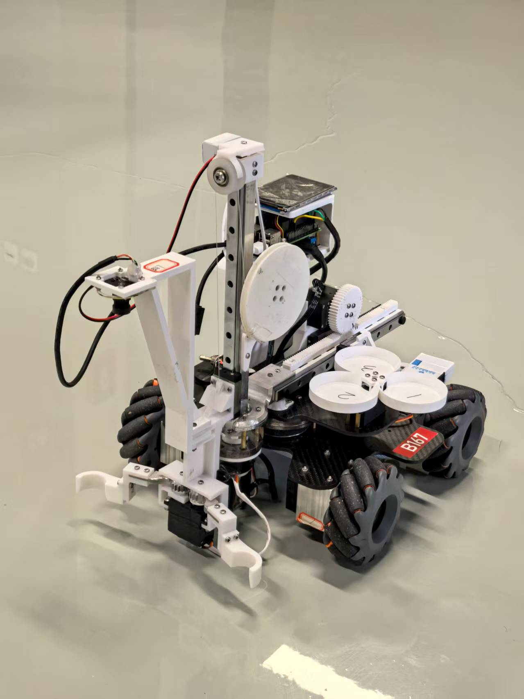
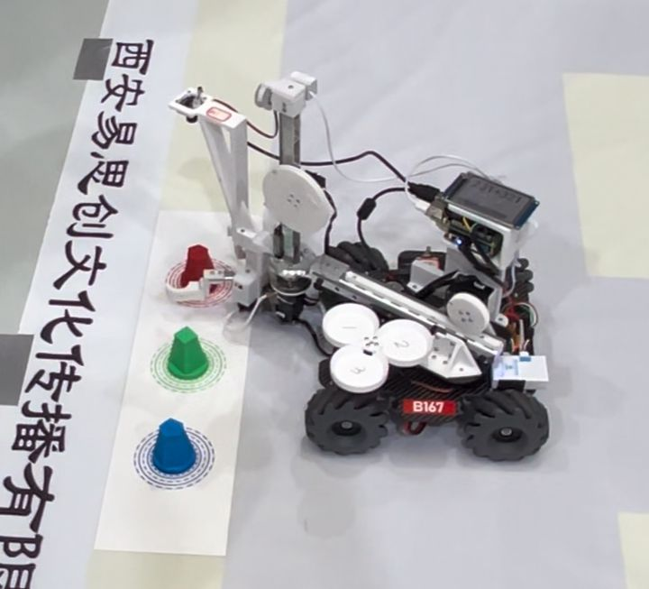
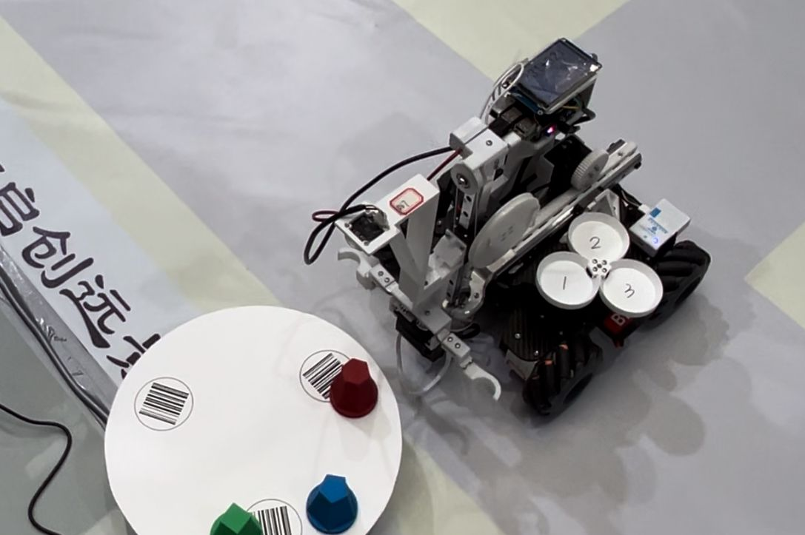
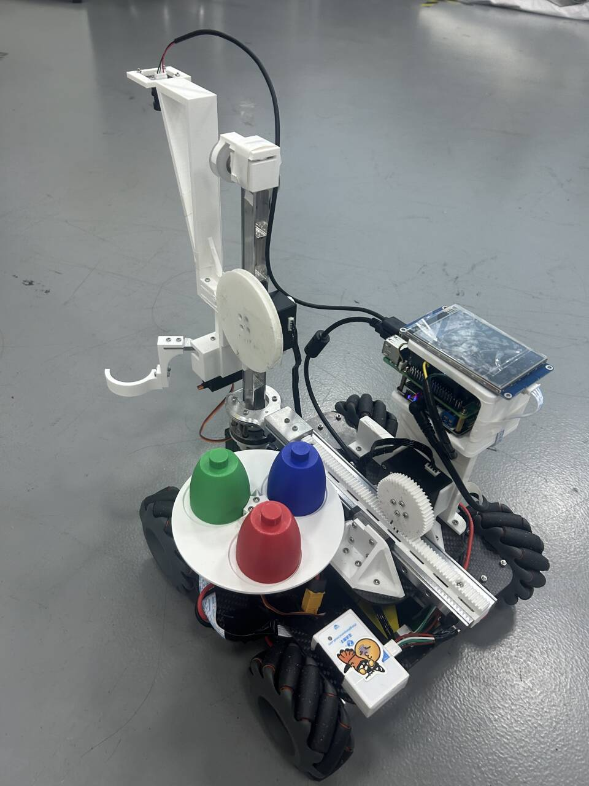
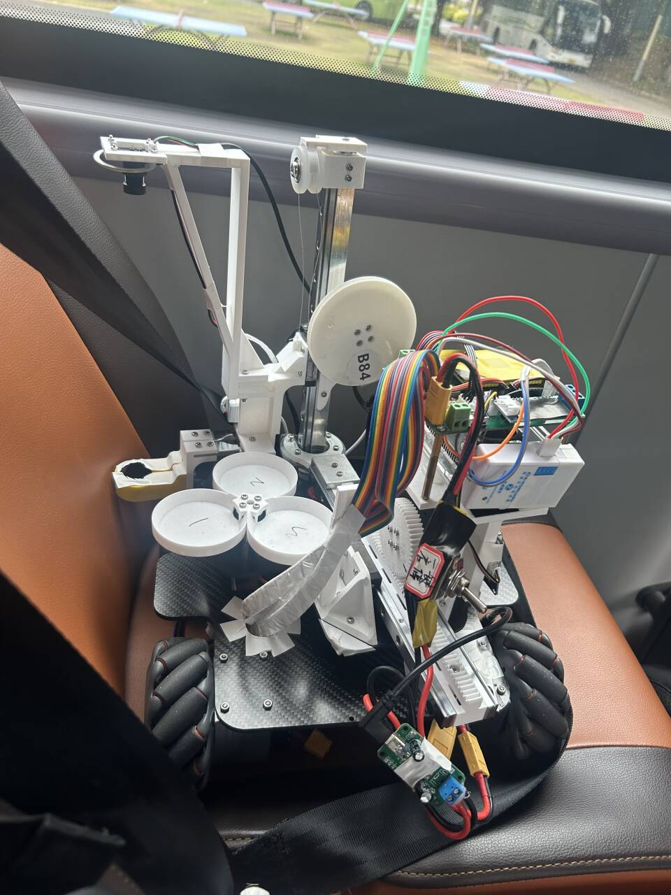
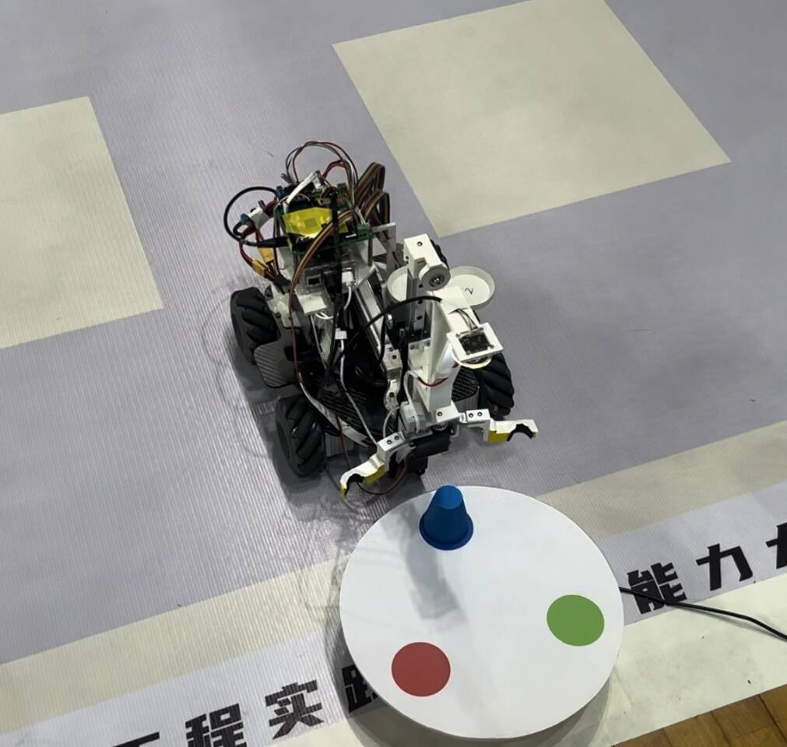

## 前言

欢迎参加物流搬运赛项，这是一个仅广东省赛就有一百多支队伍参加的赛项，而且由于题目变化不大，内卷极其严重。正如学长所说，一个学校最多只有两支队伍能进国赛，而且省赛晋级比例也就不足10%。

同时，这个比赛想进国赛拿国一可不是那么容易的，如果你还有实验室项目或者参加战队或者大三可能要考研的话还是建议认真考虑，毕竟按照25年工创赛国赛的情况，备赛周期从2024.9一直到了2025.8（虽然这是因为最终国赛延期举办了）

我们队最终是拿到了全国特等奖（国赛第五名）

Github仓库地址：（目前已闭源）
https://github.com/CycleYerik/Smart_Logistics_Handling_Robot

作者：CY （联系qq：908431711 or email： ChenYeCycle@outlook.com）

下面是国赛版本的车和比赛现场

下面是省赛版本的车和比赛现场

## 题目分析
比赛的决定性因素：
- 底盘位置移动的控制：主要是精度，无论是开环跑直线还是根据视觉进行微调，都对底盘的操纵性提出了很高的要求。其实核心的要求就是移动的稳定性，但目前看到的各种方案（陀螺仪配合编码器、陀螺仪配合ops等）都无法实现无需任何视觉校正的定位，所以总归是需要视觉进行位置姿态校正的，那其实底盘移动的精度不需要那么高，只要保证移动的稳定性即可。有些车采用的底盘控制方案过于追求精度，导致对发车位置、发车姿态、乃至场地地面情况都有非常高的要求。同时有些队伍的底盘路径是手调出来的，并没有理论值，所以一旦移动路径任务改变，则可能路径都走错
- 视觉识别的准确度和速度：在比赛环境下，可能会有不同的光照条件甚至阴影，对于颜色识别的干扰可能很大。同时，识别的速度也要越快越好，减少时间（这一点尤为重要，无论省赛还是国赛初赛，都有很多队死在二维码识别、转盘识别上，究其原因大概率就是因为光线环境的变化、物料颜色色差的变化等造成视觉失灵）
- 放置物料和抓取物料的动作速度：尽量做到连续抓取和放置，减少时间，同时保证放置的精度（哪怕到了国赛初赛，也有很多队伍的车明显看出来动作执行顺序和速度没有优化，在抓取放置上花费了太多的时间，在3min的运行时间限制下导致总分较低。与此形成对照的就是我们国赛决赛时其实放置准确度也收到色差干扰而严重失误，一环率只有4/12，但我们运行速度快，放完了十二个环，有些队虽然个个放置的都是一环，但只能放置九个环甚至放不到九个，反而被淘汰）
- 夹爪的设计：一个好的夹爪在能保证稳定夹取的同时还能不让物料在夹爪臂移动的过程中产生晃动或者影响视觉的识别，最好还具有通用性，比如我们国赛决赛就需要用一个爪子抓取三个不同形状的物料，也有省赛题目出现过两轮分别抓取不同形状的物料）

初赛：
- 由于是给定题目的，所以核心就是在尽量保证放置精度的情况下提升速度，从而得到更多的分数（我们后续国赛为了能在三分钟内完赛，每个物料放置只给了1.5秒的调整定位时间，哪怕调不准也得放，这样才能完赛）
- 要考虑到光照条件、物料重量等环境因素，还要做好各种器件的备用件和预案（比如夹爪断了、主控板烧了、VNC连接不上等）（我们上场准备了一个小箱子，里面包含了胶布、502胶、螺丝刀、备用主控板、备用夹爪、备用烧录器等，还为了防止树莓派vnc无法连接，准备了显示屏、键盘、鼠标来对树莓派进行控制。还准备了一套完整的3D打印件备件，防止车在托运、比赛过程中器件损坏导致无法运行）

决赛：
- 决赛题目会有变化，所以需要提前准备好各种功能函数的实现，到时候直接调用然后写改逻辑即可（否则现场写功能，在没有车进行调试的情况下几乎是不可能完成的任务，无论省赛还是国赛，能成绩较好的都是提前写出了很多决赛功能的）（比如我们国赛决赛从地上抓取随机顺序摆放的物料的功能早就实现过了，将物料放置在旋转转盘上也写过，只是没有写过放置在条形码上的程序，所以我们国赛功能改改就直接上了）
- 机械部分负责人需要提前练习夹爪的绘制，在创新实践环节能快速画出一个好用的爪子。需要提前练习，设计不同形状的物料，还要考虑物料的重量（我们尝试过从30g到100g的各种重量的物料，有些物料，形状相同，重量一增加就极其难夹），还要考虑到物料的色差（比如国赛的蓝色和绿色物料都有色差，我们的视觉识别还没出问题，但有很多队的识别就一下死了）

## 问题和教训参考

#### 碎碎念
- 改程序尽量注释而不是直接删掉，防止改完后忘了原来代码怎么写的
- 调车经验之谈：上电前务必三思，防止烧器件、忘了调参、忘了关电源等等；不要与一个问题或者故障死磕太久，防止陷入死胡同；最好不要一个人调
- 工程代码的设计在最开始就要进行结构化，防止后期的屎山和混乱（否则各种常用的功能函数或者底层实现一旦混乱改起来非常痛苦且危险
- **做好代码版本管理**（最好针对不同的测试或者尝试安排不同的分支，这样避免某些功能最终弃用但因为不好全部删除而导致屎山留存在工程中）（还有就是在进行各种新功能加入或者大改时做好版本管理，一旦出现问题还可以回退，不至于进退两难）
- **初始的机械结构选型务必务必务必务必务必务必务必谨慎**，不然到了后期改选型实在困难和痛苦，能用机械结构解决的问题尽量就别通过软件程序解决，不然可能带来巨大的隐患（比如通过金属加工件、防滑螺丝等保证结构的稳定性）
- **不要有畏难情绪**：很多问题一出现可能看起来非常麻烦，但要下定决心解决，否则最后调来调去还是无法回避这个问题（比如前期在尝试陀螺仪配合编码器进行位置姿态解算时认为过于复杂，几次尝试效果都不好，最后认为放弃了，但实际上如果坚持开发下去这套硬件是可以实现不错的定位效果的）

#### 遇到的问题

##### 软件
- 别问为什么用keil和CubeMX而不用CubeIDE这种明显更现代的平台，问就是祖宗之法不可变
- 大量的粗心错误，包括但不限于：忘记修改或者注释代码；忘记将测试代码改回正式代码；函数调用错误；命名错误
- 混乱的程序，包括但不限于：大量的相近代码没有实现复用，部分流程过于复杂
- 随意的代码管理，包括但不限于：没有及时备份代码；没有使用git进行版本管理导致不记得自己改了什么；代码没有交叉检查和review
- 裸机的屎山：还是得考虑上rtos

##### 硬件
- 硬件PCB设计的不合理：功率和非功率的5V没有分开导致烧板子；拨码开关无法耐受大电流导致的电火花和击穿。
- 接线的混乱：很多线缺少外部保护措施和固定装置，容易出现磨损、脱落
- 安全意识不强：缺少疯跑保护措施；缺少短路保护措施导致24V直接短路

##### 机械
- 画图和设计的方法不当：容易缺少实际的测量，有时数据不准
- 结构问题导致车身重心偏前或者四个轮子安装略微不平行

##### 团队和沟通
- 懂得都懂

##### 调试
- 有线调试器（stlink）实在不方便
- 出现过多次的忘记接线（舵机、串口、电源）和接错线

